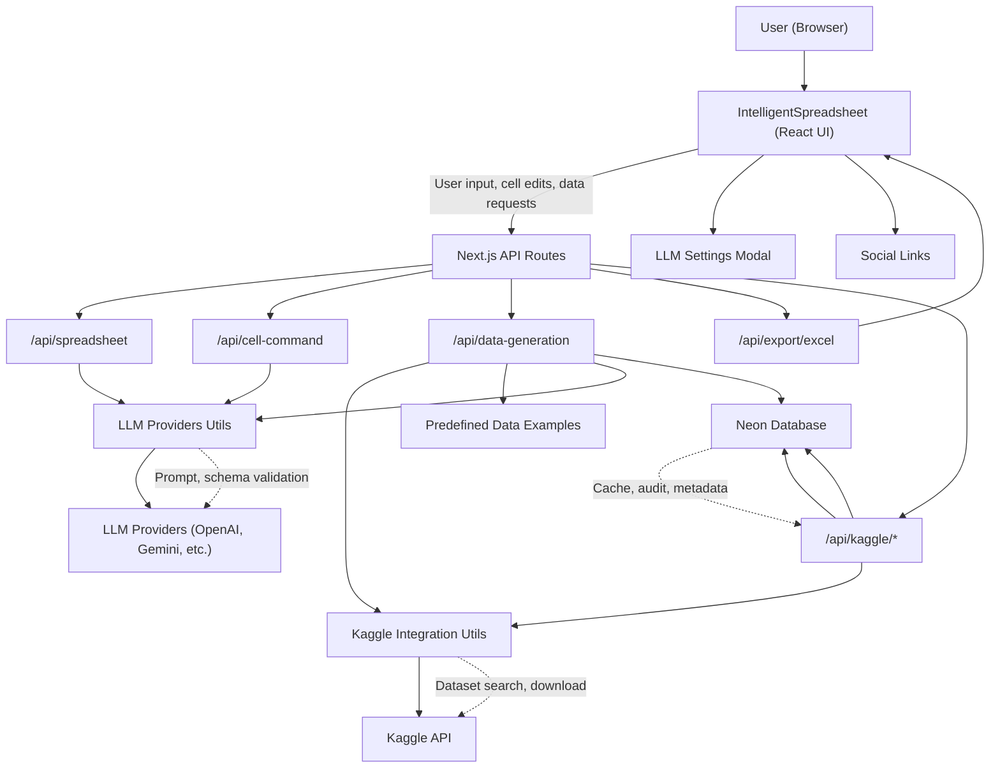

# Synthetic Data Generator

[](https://nextjs.org/)
[](https://www.typescriptlang.org/)
[](https://tailwindcss.com/)
[](https://neon.tech/)
[](#)

---

## Overview

**Synthetic Data Generator** is a modern web application for generating, editing, and exporting tabular data using AI and real-world datasets. It features an intelligent spreadsheet UI, natural language data requests, and seamless integration with Kaggle and Neon database for data sourcing, caching, and audit trails.

---

## Features

- 🧠 **AI-powered Data Generation**: Generate realistic or synthetic datasets using LLMs (OpenAI, Gemini, Groq, Cohere, etc.)
- 🔍 **Kaggle Integration**: Search, preview, and use real datasets from Kaggle
- 📝 **Intelligent Spreadsheet**: Edit, analyze, and manipulate data in a familiar spreadsheet interface
- 📤 **Export**: Download your data as CSV or Excel files
- ⚡ **Custom LLM Provider Support**: Choose your preferred AI provider, model, and API key
- 🗂️ **Predefined Data Examples**: Instant sample data for common use cases
- 🗄️ **Neon Database**: Caching, audit logging, and metadata storage for Kaggle operations
- 🎨 **Modern UI**: Responsive, animated, and themeable interface

---

## Architecture



---

## How It Works

### 1. User Interface
- **IntelligentSpreadsheet**: Main UI for data entry, editing, and visualization.
- **LLM Settings Modal**: Configure AI provider, model, and API key.
- **Social Links**: Quick access to project repository.

### 2. Backend API
- **/api/spreadsheet**: Interprets user commands and returns spreadsheet actions using LLMs.
- **/api/cell-command**: Processes cell-specific commands (e.g., "Set A1 to 100") via LLM.
- **/api/data-generation**: Analyzes data requests, fetches from Kaggle, generates synthetic data, or uses predefined examples.
- **/api/export/excel**: Converts spreadsheet data to downloadable Excel files.
- **/api/kaggle/**: Handles Kaggle dataset search, selection, file preview, and metadata caching (with Neon).

### 3. Utilities & Helpers
- **Kaggle Integration**: Handles all Kaggle API interactions.
- **LLM Providers**: Unified interface for multiple LLM APIs.
- **Predefined Data Examples**: Fallback/sample data for common domains.
- **Spreadsheet Utils**: Formula evaluation, cell reference conversion, etc.

### 4. Database (Neon)
- **Purpose**: Caches Kaggle file previews, stores dataset metadata, and logs user/audit events.
- **Why Neon?**: Fast, serverless Postgres for efficient caching, auditability, and scalable storage.

---

## Getting Started

### Prerequisites
- Node.js 18+
- pnpm (or npm/yarn)

### Installation
```bash
pnpm install
# or
npm install
```

### Running Locally
```bash
pnpm dev
# or
npm run dev
```

### Environment Variables
Create a `.env.local` file with the following (as needed):
```
KAGGLE_API_KEY=your_kaggle_api_key
KAGGLE_USERNAME=your_kaggle_username
# LLM provider keys (optional)
OPENAI_API_KEY=your_openai_api_key
GEMINI_API_KEY=your_gemini_api_key
COHERE_API_KEY=your_cohere_api_key
GROQ_API_KEY=your_groq_api_key
```

---

## Project Structure

| Path                        | Purpose                                    |
|-----------------------------|--------------------------------------------|
| `app/`                      | Next.js app directory (pages, API routes)  |
| `components/`               | React UI components                        |
| `hooks/`                    | Custom React hooks                         |
| `lib/`                      | Utility functions                          |
| `utils/`                    | Data, LLM, Kaggle, spreadsheet utilities   |
| `public/`                   | Static assets                              |
| `styles/`                   | Global styles (Tailwind)                   |
| `scripts/`                  | Utility scripts                            |

---

## Tech Stack

- **Next.js** (App Router)
- **TypeScript**
- **TailwindCSS**
- **Framer Motion** (animations)
- **Neon Database** (Postgres)
- **Kaggle API**
- **Multiple LLM Providers** (OpenAI, Gemini, Groq, Cohere, etc.)

---

## Contributing

Pull requests are welcome! For major changes, please open an issue first to discuss what you would like to change.

---

## No License

This project is provided without any license. All rights reserved. 